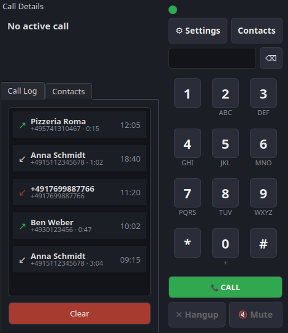

# voice2fritz

*[English version](README.md)*

Ein SIP-Softphone für Linux-Desktops, das sich an einer FRITZ!Box
anmeldet und Anrufe über ein Headset ermöglicht – eingehend wie
ausgehend. Speziell für die FRITZ!Box gebaut – keine allgemeine
Multi-Provider-SIP-Konfiguration, nur Host, Benutzername und Passwort.



Getestet mit einer FRITZ!Box 7590.

Siehe [CHANGELOG.md](CHANGELOG.md) für die Versionshistorie. Lizenziert
unter der [MIT-Lizenz](LICENSE).

## Einrichtung

`voice2fritz` benötigt `pjsua2` (die Python-Bindings von PJSIP), die
nicht über PyPI verteilt werden.

```bash
python3 -m venv .venv
.venv/bin/pip install -e ".[dev]"
```

### pjsua2 bauen (Linux, Beispiel Arch)

```bash
sudo pacman -S swig portaudio  # bzw. die entsprechende Build-Abhängigkeit deiner Distribution

git clone --depth 1 https://github.com/pjsip/pjproject.git
cd pjproject
echo '#define PJMEDIA_AUDIO_DEV_HAS_PORTAUDIO 1' > pjlib/include/pj/config_site.h
./configure --enable-shared --disable-video --with-external-pa
make dep
make
cd pjsip-apps/src/swig
make python
```

`--with-external-pa` zusammen mit dem Define
`PJMEDIA_AUDIO_DEV_HAS_PORTAUDIO` aktiviert zusätzlich zum
Standard-ALSA-Backend das PortAudio-Backend von PJSIP. Das ist in der
Praxis relevant: Auf einem PipeWire/PulseAudio-Desktop sieht pjsua2s
reine ALSA-Erkennung nur generische Sammelgeräte (`pulse`, `pipewire`,
`default`) – einzelne Hardwaregeräte melden 0 Kanäle, weil PipeWire die
Karte exklusiv belegt. PortAudio fragt stattdessen über die
Geräteliste von PipeWire/PulseAudio ab, sodass echte, gerätespezifische
Namen erscheinen (z. B. `Astro A50: USB Audio #1 (hw:1,1)`) und in den
Geräte-Dropdowns von voice2fritz direkt auswählbar sind – statt eines
einzigen, mehrdeutigen `pulse`-Eintrags.

Das gebaute Modul in das venv von voice2fritz kopieren:

```bash
VENV_SITE=$(../../../../../.venv/bin/python -c "import sysconfig; print(sysconfig.get_paths()['purelib'])")
cp python/build/lib.*/pjsua2.py python/build/lib.*/_pjsua2*.so "$VENV_SITE/"
```

Ohne Root-Rechte für `make install` liegen die gebauten Shared
Libraries (`libpjsua2.so` usw.) nicht im System-Loader-Pfad. Sie an
einen dauerhaften Ort kopieren und beim Start von voice2fritz
`LD_LIBRARY_PATH` darauf zeigen lassen:

```bash
mkdir -p ~/.local/lib/pjsip
cp -a pjlib/lib/*.so* pjlib-util/lib/*.so* pjnath/lib/*.so* \
      pjmedia/lib/*.so* pjsip/lib/*.so* third_party/lib/*.so* \
      ~/.local/lib/pjsip/

LD_LIBRARY_PATH=~/.local/lib/pjsip .venv/bin/python -m voice2fritz.main
```

Wer Root-Rechte hat und stattdessen eine systemweite Installation
bevorzugt: `sudo make install && sudo ldconfig` im `pjproject`-Wurzelverzeichnis
– dann ist `LD_LIBRARY_PATH` nicht nötig.

## Google-Kontakte-Synchronisation einrichten (optional)

1. In der [Google Cloud Console](https://console.cloud.google.com/) ein
   neues Projekt anlegen (oder ein bestehendes verwenden).
2. Für dieses Projekt die **People API** aktivieren (APIs & Dienste →
   Bibliothek → "People API" suchen → Aktivieren).
3. APIs & Dienste → Anmeldedaten → Anmeldedaten erstellen → OAuth-Client-ID.
   Anwendungstyp **Desktop-App** wählen.
4. Die heruntergeladene JSON-Datei unter
   `~/.config/voice2fritz/google_client_secret.json` speichern.
5. In voice2fritz: Kontakte → Sync Google öffnen. Beim ersten Sync öffnet
   sich der Browser für die Google-Zustimmung; bestätigen. Ein Token wird
   unter `~/.config/voice2fritz/google_token.json` gespeichert, damit
   spätere Syncs ohne Browser auskommen.

Beide Dateien bleiben lokal und werden nie ins Repository übernommen –
`google_token.json` wie ein Passwort behandeln, da es ein Refresh-Token
für den Google-Account enthält.

Steht der OAuth-Zustimmungsbildschirm im Veröffentlichungsstatus "Testing"
(Standard, und das Ergebnis dieser Anleitung), lässt Google Refresh-Token
nach etwa 7 Tagen ablaufen; voice2fritz fragt dann beim nächsten Sync
automatisch erneut im Browser nach Zustimmung – ein unerwartetes Popup ist
also kein Fehler.

Es werden nur Kontakte synchronisiert, die im Google-Account gesichert
sind – Kontakte, die nur lokal auf dem Gerät gespeichert sind (nicht mit
Google synchronisiert), erscheinen nicht, da die People API nur
account-synchronisierte Kontakte liefert. Auf dem Handy gelöschte
Kontakte werden beim Sync aktuell auch nicht aus dem lokalen
Telefonbuch von voice2fritz entfernt; dies ist eine bekannte
Einschränkung.
