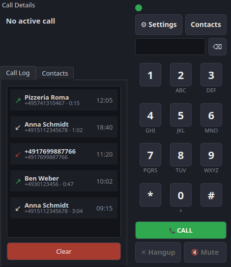

# voice2fritz

*[Deutsche Version](README.de.md)*

A Linux desktop SIP softphone that registers with a FRITZ!Box and lets you
make and receive calls over a headset. Built specifically for FRITZ!Box —
no generic multi-provider SIP configuration, just host, username, and
password.



Tested against a FRITZ!Box 7590.

See [CHANGELOG.md](CHANGELOG.md) for release notes. Licensed under the
[GNU General Public License v3.0 or later](LICENSE).

## Windows (experimental)

Every release gets a Windows build, `voice2fritz-<version>-windows-x64.zip`,
on the [releases page](https://github.com/drachenhort/voice2fritz/releases):
unzip it and run `voice2fritz.exe`. It's built automatically by a GitHub
workflow (pjproject compiled with Visual Studio, packaged with PyInstaller)
and has **not been tested on a real Windows machine** - the maintainer
doesn't use Windows. On Windows the audio device list shows the devices
as PJSIP names them, and the Call audio IP row shows only the address,
without the network type.

If you try it, please [open an issue](https://github.com/drachenhort/voice2fritz/issues)
and say whether registering, calling and audio work.

## Setup

`voice2fritz` requires `pjsua2` (PJSIP's Python bindings), which is not
distributed on PyPI.

```bash
python3 -m venv .venv
.venv/bin/pip install -e ".[dev]"
```

### Building pjsua2 (Linux, Arch example)

```bash
sudo pacman -S swig portaudio  # or the equivalent build dependency on your distro

git clone --depth 1 https://github.com/pjsip/pjproject.git
cd pjproject
echo '#define PJMEDIA_AUDIO_DEV_HAS_PORTAUDIO 1' > pjlib/include/pj/config_site.h
./configure --enable-shared --disable-video --with-external-pa
make dep
make
cd pjsip-apps/src/swig
make python
```

`--with-external-pa` plus the `PJMEDIA_AUDIO_DEV_HAS_PORTAUDIO` define
enable PJSIP's PortAudio backend on top of the default ALSA one. It is
optional: on a PipeWire/PulseAudio desktop, pjsua2's ALSA enumeration only
sees cryptic names (`hdmi:CARD=HDMI,DEV=1`, `surround41:CARD=A2,DEV=0`, …)
and misses most hardware, because PipeWire owns the cards. voice2fritz
therefore asks the sound server itself (`pactl`) for its devices and shows
them by their readable names (e.g. `Arctis Nova 7 Chat`), the same ones
your desktop sound settings use. Audio is routed to the chosen device
through ALSA's `pulse` plugin. Without `pactl`, the dropdowns fall back to
the raw pjsua2 device list.

Copy the built module into voice2fritz's venv:

```bash
VENV_SITE=$(../../../../../.venv/bin/python -c "import sysconfig; print(sysconfig.get_paths()['purelib'])")
cp python/build/lib.*/pjsua2.py python/build/lib.*/_pjsua2*.so "$VENV_SITE/"
```

Without root access to run `make install`, the built shared libraries
(`libpjsua2.so` etc.) aren't on the system loader path. Copy them
somewhere persistent and point `LD_LIBRARY_PATH` at that directory
whenever running voice2fritz:

```bash
mkdir -p ~/.local/lib/pjsip
cp -a pjlib/lib/*.so* pjlib-util/lib/*.so* pjnath/lib/*.so* \
      pjmedia/lib/*.so* pjsip/lib/*.so* third_party/lib/*.so* \
      ~/.local/lib/pjsip/

LD_LIBRARY_PATH=~/.local/lib/pjsip .venv/bin/python -m voice2fritz.main
```

If you do have root and prefer a system-wide install instead:
`sudo make install && sudo ldconfig` from the `pjproject` root — then
`LD_LIBRARY_PATH` isn't needed.

## Setting up Google Contacts sync (optional)

1. Go to the [Google Cloud Console](https://console.cloud.google.com/),
   create a new project (or reuse one).
2. Enable the **People API** for that project (APIs & Services → Library
   → search "People API" → Enable).
3. Go to APIs & Services → Credentials → Create Credentials → OAuth
   client ID. Choose application type **Desktop app**.
4. Download the resulting JSON file and save it as
   `~/.config/voice2fritz/google_client_secret.json`.
5. In voice2fritz, open Contacts → Sync Google. The first sync opens
   your browser for Google's consent screen; approve it. A token is
   saved to `~/.config/voice2fritz/google_token.json` so later syncs
   don't need the browser again.

Both files are local-only and never committed to source control — treat
`google_token.json` like a password, since it holds a refresh token for
your Google account.

If your OAuth consent screen is in "Testing" publishing status (the
default, and what this walkthrough produces), Google expires refresh
tokens after about 7 days; voice2fritz will automatically re-prompt for
consent in your browser the next time you sync, so don't be surprised by
an unexpected popup.

Only contacts backed up to your Google account sync — contacts saved
only on the device itself (not synced to Google) won't appear, since the
People API only returns account-synced contacts. Contacts deleted on the
phone are also not currently removed from voice2fritz's local phonebook
on sync; this is a known limitation.
